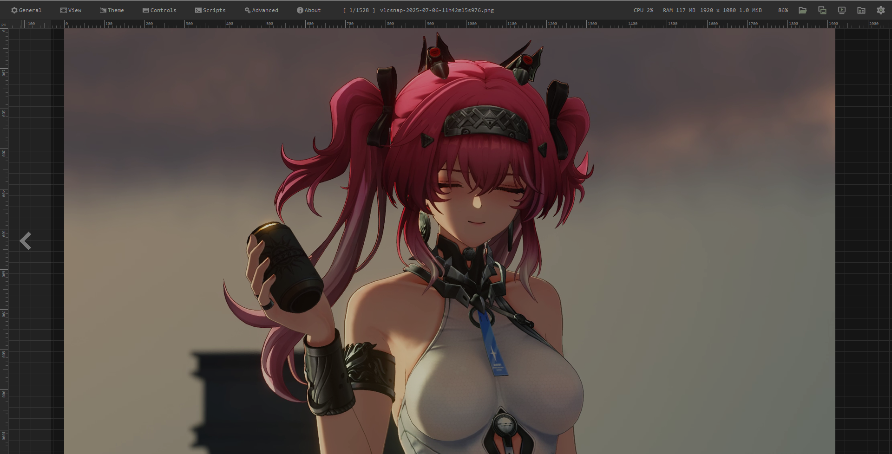
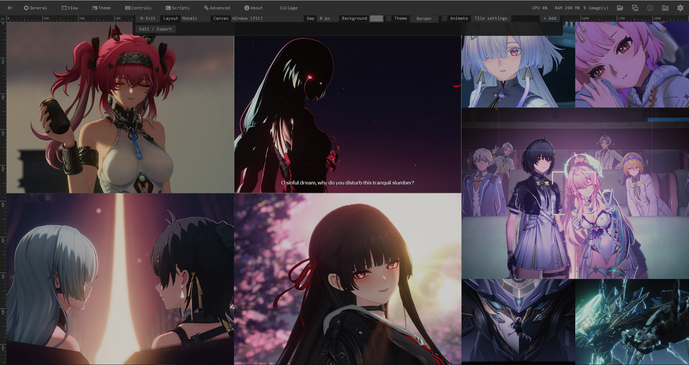
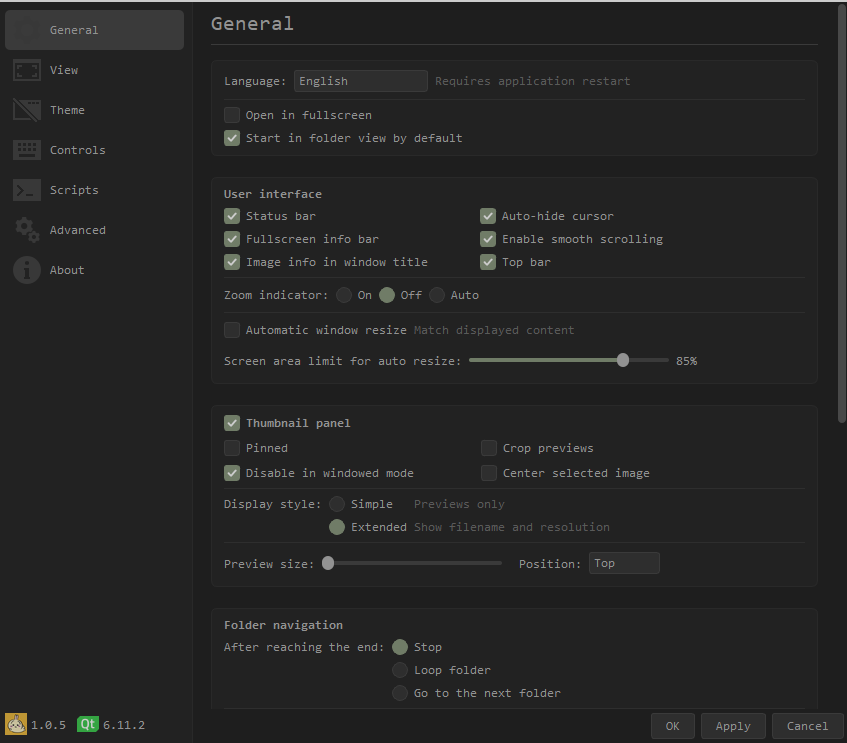

A personal fork of [qimgv](https://github.com/easymodo/qimgv) by easymodo, made for my own use. I do not claim or own anything in the original project.

qimgv | Current version: 1.0.6
=====
A fast, lightweight image viewer with a clean, uncluttered interface: panels and bars only show up when you need them. Video playback is optional.

## Screenshots

Main window & panel        |  Collage view   |  Settings window  
:-------------------------:|:-------------------------:|:-------------------------:|
[] |  []| []

## New key features

- **Collage view and export** - arrange several images on one canvas (Mosaic, Grid, Row, Column or Freehand layouts), adjust every tile, and export the result as an image. Open it with __Ctrl+G__. See [Collage](#collage).

- **Improved slideshow** - a floating control bar, 13 transition styles (fade, slide, blur, pixel mash, wipe, iris, dissolve...), an adjustable easing curve, duration and strength, and optional file name / date captions. See [Slideshow](#slideshow).

- **More image formats** - WebP, TIFF, TGA, WBMP and ICNS out of the box, plus JPEG-XL, AVIF, APNG, HEIF and RAW through plugins. See [Additional image formats](#additional-image-formats).

- **Batch image format conversion** - convert many images to another format in one go.

- **Rulers and guides, top bar** - pixel / % / cm / in rulers with draggable guides, and a slim top bar with the settings menu, zoom level and an optional CPU / RAM readout. See [Top bar](#top-bar).

## Default control scheme:

| Action  | Shortcut |
| ------------- | ------------- |
| Next image  | Right arrow / Ctrl+MouseWheel |
| Previous image  | Left arrow / Ctrl+MouseWheel |
| Goto first image  | Home |
| Goto last image  | End |
| Zoom in  | MouseWheel / Ctrl+Up |
| Zoom out  | MouseWheel / Ctrl+Down |
| Zoom (alt. method) | Hold right mouse button & move up / down |
| Move the image freely (even when it fits the window) | MiddleMouse drag |
| Reset a moved / zoomed image (back to the default fit, centred) | MiddleMouse click (a fit mode key also re-centres it) |
| Fit mode: window | 1 |
| Fit mode: width | 2 |
| Fit mode: 1:1 (no scaling) | 3 |
| Fit mode: window (stretch) | 4 |
| Switch fit modes  | Space |
| Toggle fullscreen mode  | DoubleClick / F / F11 |
| Exit fullscreen mode | Esc (never quits the app) |
| Show EXIF panel  | I |
| Crop image  | X |
| Resize image  | R |
| Rotate left  | Ctrl+L |
| Rotate Right  | Ctrl+R |
| Flip horizontal / vertical | H / V |
| Open containing directory | Ctrl+D |
| Slideshow mode | Slideshow button in the top bar / context menu (no default key, bind `toggleSlideshow` in Settings > Controls) |
| Toggle rulers / guides | Ctrl+Shift+R (Settings > View > Rulers & guides; drag from a ruler to add a guide, drag a guide back onto a ruler to remove it, right-click a ruler for units) |
| Ruler settings (add a guide at an exact px / % / cm / in, snap to multiples of 2 / 5 / 10 ...) | Double-click a ruler |
| Shuffle mode | Ctrl+\` |
| Quick copy  | C |
| Quick move  | M |
| Move to trash | Delete |
| Delete file  | Shift+Delete |
| Save  | Ctrl+S |
| Save As  | Ctrl+Shift+S |
| Discard edits | Ctrl+Z |
| Rename | F2 |
| Reload image | F5 |
| Copy file / copy path / paste file | Ctrl+C / Ctrl+Shift+C / Ctrl+V |
| Set as wallpaper | Ctrl+W |
| Next / previous folder | Shift+Right / Shift+Left |
| Toggle fullscreen info bar | Shift+F |
| Zoom (keys) / scroll | + - = (also with Ctrl) / Up Down |
| Video: seek / frame step | Ctrl+Left / Ctrl+Right, `,` `.` |
| Mouse side buttons | previous / next image |
| Context menu | Right click / Menu key |
| Folder view | Enter / Backspace |
| Open | Ctrl+O |
| Collage view | Ctrl+G |
| Print / Export PDF | Ctrl+P |
| Settings  | P |
| Exit application | Ctrl+Q / Alt+X |

... and more.

Note: you can configure every shortcut by going to __Settings > Controls__

### Top bar

- The menu row on the left (General, View, Theme, Controls, Scripts, Advanced, About) opens the settings dialog on that page. On narrow windows it collapses into a *Settings* dropdown.

- The percentage on the right is the current magnification of the image.

- __Settings > View > Performance > Show CPU / RAM usage in the top bar__ (on by default) adds the CPU and memory usage of qimgv itself, updated every second. Hidden on narrow windows. In fullscreen the same readout shows in the top right corner together with the fullscreen info bar.

- The bar can be turned off in __Settings > General > Top bar__ (it is always hidden in fullscreen).

### Slideshow

Start it with the Slideshow button in the top bar (or the context menu). The window is stripped down to the picture: the top bar, panels and info bars are hidden. Move the mouse to bring up the slideshow bar; after a moment without movement the bar and the cursor hide again. The bar has previous / pause / next, the timer, the transition style, Loop, the settings gear and Exit. The timer, style and loop can also be set in __Settings > General > Slideshow__. Editing actions (delete, crop, rename...) are blocked while it runs.

#### Slideshow settings

The gear on the bar opens a popup above it. Changes apply immediately. It closes with Esc or a click outside it, and the bar stays visible while it is open. Controls that the chosen transition style does not use are greyed out.

| Option | What it does |
| ------------- | ------------- |
| Captions | Shows the file name and / or the date the file was modified, bottom left. __Text size__ scales them from 75 to 300 % |
| Duration | How long one transition takes, 0.08 - 3 s (capped at 80 % of the time per slide) |
| Easing | How the transition speeds up and slows down. Pick a preset, or drag the two handles of the curve (double-click a handle to reset it). The curve may overshoot for a springy feel |
| Strength | The main amount of the effect: blur radius, pixel size, zoom, travel distance, motion trail length... |
| Softness | Width of the soft edge of Wipe and Iris |
| Block size | Tile size of Dissolve |
| Direction | Which way the old slide leaves: Auto (follows next / previous), Left, Right, Up or Down |
| Dip color | The color __Dip to color__ fades through: any color from the picker, or Black / White / Accent |
| Random style | Uses a different transition style on every slide (never the same one twice in a row) |

#### Transition styles

| Style | What it looks like |
| ------------- | ------------- |
| None | Instant switch |
| Fade | The old slide fades into the next one |
| Slide | The old slide slides away and uncovers the next one |
| Zoom | The old slide zooms in while it fades out |
| Dip to color | Fades to a color, then from that color into the next slide |
| Blur fade | The old slide blurs out while the next one sharpens in |
| Motion blur | Both slides sweep across the screen with a motion trail |
| Pixel mash | Both slides break into big pixels and swap at the coarsest point |
| Push | The next slide pushes the old one out |
| Cover | The next slide slides in over the old one, which dims |
| Wipe | A soft edge sweeps across and replaces the old slide |
| Iris | The next slide opens up from the centre in a growing circle |
| Dissolve | Random tiles of the old slide fade away |

#### Slideshow keys

| Action (slideshow) | Shortcut |
| ------------- | ------------- |
| Pause / resume | Space |
| Previous / next slide | Left / Right |
| Close the settings popup | Esc (first press, while it is open) |
| Leave the slideshow | Esc (in fullscreen: leaves fullscreen first) |
| Fullscreen | F / F11 |

### Interface font

__Settings > General > Interface font__ (default Consolas, falls back to another monospace font when Consolas is not installed). Applied right away.

### Collage

Combine several images on one canvas and export the result. Open it with __Ctrl+G__ (or the collage button in the top bar): select 2+ images in folder view first, or pick files in the dialog. Choose how the tiles are arranged with the __Layout__ dropdown, then adjust each tile and export.
Only a few shortcuts work while the collage is open (open, settings, fullscreen, folder view).

| Action (collage view) | Shortcut |
| ------------- | ------------- |
| Zoom the whole collage | MouseWheel |
| Move the whole collage freely (any layout, also when starting on a tile) | Hold MiddleMouse + move |
| Fit the collage back into the window | MiddleMouse click / Ctrl+0 |
| Pan the whole collage | Drag empty space |
| Resize two neighbouring tiles (Mosaic / Grid / Row / Column) | Drag the border between them (Snap mode locks to 1/4, 1/3, 1/2, 2/3, 3/4; Alt = free; double-click = reset) |
| Change a number field (W / H, gap, canvas, border...) | Drag it sideways (Shift = x10, Alt = finer), or click and type |
| Move the picture inside its tile | Drag the tile (Alt+drag also works) |
| Zoom the picture inside its tile | Shift+MouseWheel over the tile |
| Swap two tiles | Ctrl+drag a tile onto another |
| Open a tile in the normal viewer | DoubleClick / Enter (the top bar Back button, Backspace or Esc returns to the collage) |
| Back (editor -> collage view -> image viewer) | Esc (when no tile is selected); leaving the collage view asks first, the collage stays in memory (Ctrl+G resumes it) |
| Tile settings (aspect, size, crop, resolution) | Right click a tile |
| Select previous / next tile | Left / Right arrow (Freehand layout: nudge the tile, Shift = 10 px) |
| Place tiles yourself | Layout -> Freehand: drag a tile, drag the handles to resize (Shift keeps proportions), Alt+drag moves the picture, Page Up / Page Down = front / back, Ctrl+0 = back to the centre |
| Play / pause the selected animated tile (none selected: all) | Space |
| Remove tile | Delete |
| Switch to editor / back to view | E |
| Show the toolbar (it slides in, and slides out again after a moment) | Move the cursor to the top edge |
| Canvas (Window, pixel presets like 1920 x 1080 / 1080 x 1920, Custom W x H, shared with the editor) | "Canvas" dropdown in the bar (not used by Freehand) |
| Background colour with opacity (or the theme background) / tile outline (width, colour, style) | "Background" + "Color" + opacity % / "Border" in the bar |
| Grid / Row / Column options (columns, rows, cell size, rotation, style: tiles, circle, hexagon, polygon / star) | "Layout options" in the bar |
| Exit the collage | "Exit" (first button of the bar) |
| Crop in Freehand (drag pans the picture, wheel zooms it, handles off) | "Crop" toggle in the toolbar |

| Action (collage editor) | Shortcut |
| ------------- | ------------- |
| Move / resize a frame | Drag / drag the handles (Shift keeps proportions, Ctrl disables snapping) |
| Show the toolbar (it slides in, and slides out again after a moment) | Move the cursor to the top edge |
| Pick how frames are arranged (Mosaic is the default) | "Layout" dropdown: Mosaic / Grid / Row / Column arrange automatically (drag pans the picture, Ctrl+drag swaps frames, drag a border to resize), Freehand = place frames yourself |
| Move the canvas freely / fit it back | Hold MiddleMouse + move / MiddleMouse click |
| Outline of every frame, Grid / Row / Column options | "Border" / "Layout options" in the toolbar (exported too) |
| Pan the picture inside a frame (Freehand) | "Crop" toggle in the toolbar (drag pans, wheel zooms, handles off) or Alt+drag |
| Canvas size, incl. portrait / mobile presets (3:4, 9:16, 20:9, iPhone) | "Canvas" dropdown or W / H in the toolbar |
| Zoom the picture inside a frame | Shift+MouseWheel |
| Nudge selected frames | Arrow keys (Shift = 10 px) |
| Select all / bring to front / send to back | Ctrl+A / PageUp / PageDown |
| Fit canvas / actual size | Ctrl+0 / Ctrl+1 |
| Play / pause animated frames | Space |

# User interface

The idea is to have an uncluttered, simple and easy to use UI. UI elements only show up when you need them.

There is a pull-down panel with thumbnails, as well as a folder view. A context menu is available on right click.

## Using quick copy / quick move panels

Bring up the panel with C or M shortcut. You will see 9 destination directories, click on the folder icon to change them.

With panel visible, use 1 - 9 keys to copy/move current image to corresponding directory.

When you are done press C or M again to hide the panel.

## Running scripts

You can run custom scripts on a current image.

Open __Settings > Scripts__. Press Add. Here you can choose between a shell command and a shell script. 

Example of a command: 

`convert %file% %file%_.pdf`

Example of a shell script file (`$1` will be image path): 
```
#!/bin/bash
gimp "$1"
```
_Note: The script file must be an executable. Also, "shebang" (`#!/bin/bash`) needs to be present._

When you've created your script go to __Settings > Controls > Add__, then select it and assign a shortcut like for any regular action.

## HiDPI (Linux / MacOS only)

If qimgv appears too small / too big on your display, you can override the scale factor. Example:
```
QT_SCALE_FACTOR="1.5" qimgv /path/to/image.png
```
You can put it in `qimgv.desktop` file to make it permanent. Using values less than `1.0` is not supported.

qimgv should also obey the global scale factor set in KDE's systemsettings.

## High quality scaling

qimgv supports nicer scaling filters when compiled with `opencv` support (ON by default, but might vary depending on your linux distribution). Filter options are available in __Settings > Scaling__. `Bicubic` or `bilinear+sharpen` is recommended.

# Additional image formats

Built-in Qt plugins cover JPEG, PNG, GIF, BMP, ICO, SVG, WebP, TIFF, TGA, WBMP and ICNS (WebP / TIFF / TGA / WBMP / ICNS come from `qt6-imageformats`, which `deploy.ps1` copies next to the exe).

The format is detected from the file **content**, not the extension, so a WebP renamed to `.png` still opens.

qimgv can open some extra formats via third-party image plugins. All of them are included with windows package.

| Format  | Plugin |
| ------- | ------------- |
| JPEG-XL | [github.com/novomesk/qt-jpegxl-image-plugin](https://github.com/novomesk/qt-jpegxl-image-plugin) |
| AVIF | [github.com/novomesk/qt-avif-image-plugin](https://github.com/novomesk/qt-avif-image-plugin) |
| APNG | [github.com/Skycoder42/QtApng](https://github.com/Skycoder42/QtApng) |
| HEIF / HEIC | [github.com/jakar/qt-heif-image-plugin](https://github.com/jakar/qt-heif-image-plugin) |
| RAW | [https://gitlab.com/mardy/qtraw](https://gitlab.com/mardy/qtraw) |

# Installation

## Windows

  Download `qimgv-setup-<version>-x64.exe` from the [releases page](https://github.com/teamuhi/imgviewer/releases) and run it. The installer:
  - installs to `Program Files\qimgv` (or per-user, via the "only for me" choice), upgrades in place and uninstalls cleanly (your settings in `%AppData%` are kept);
  - adds Start menu / optional desktop shortcuts;
  - optionally registers qimgv for image files (jpg, png, gif, webp, bmp, tiff, tga, ico, svg, ...).

  Prefer no install? Download `imgviewer-win64_<version>.zip` instead: it is portable (everything is contained within the folder).

  _The installer is unsigned, so Windows SmartScreen may warn: click __More info > Run anyway__._

  _Making qimgv the default viewer:_ Windows does not let an installer do that silently. Open __Settings > Apps > Default apps__, search for qimgv and pick it for the formats you want (or right-click an image > Open with > Choose another app > Always).

## GNU+Linux

### Arch Linux / Manjaro / etc.

AUR package: 

```
qimgv-git
```
  
### Ubuntu / Linux Mint / Pop!\_OS / etc.

```
sudo apt install qimgv
```

### Fedora

```
sudo dnf install qimgv
```

### OpenSUSE

```
zypper install qimgv
```

### Gentoo

```
emerge qimgv
```

### Void linux

```
xbps-install -S qimgv
```

### Alpine Linux

```
apk add qimgv
```

## BSD

### FreeBSD

```
pkg install qimgv
```

This list may be incomplete. 

## Compiling from source

See [Compiling qimgv from source](https://github.com/easymodo/qimgv/wiki/Compiling-qimgv-from-source) on the wiki

# Donate

If you wish to give me a few bucks, please consider donating to the Ukrainian Army instead:

[https://savelife.in.ua/en/donate-en/#donate-army-card-once](https://savelife.in.ua/en/donate-en/#donate-army-card-once)

[https://u24.gov.ua/](https://u24.gov.ua/)

This directly increases the chances of me being able to work on this in future
